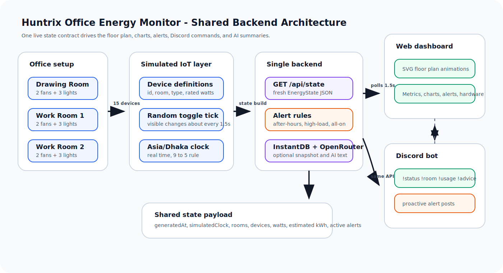
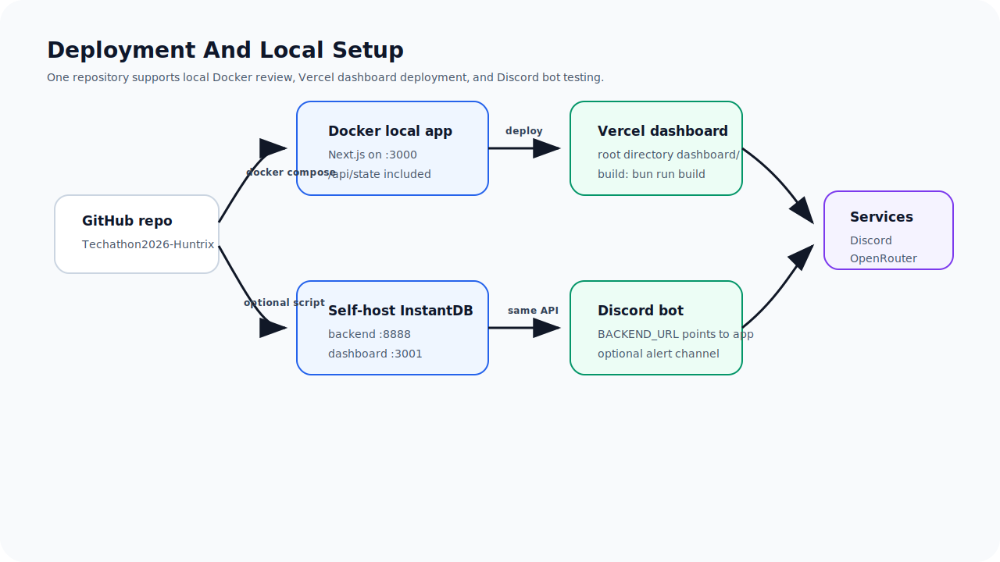

# Techathon 2026 - Office Energy Monitor

A real-time office energy monitoring system for the Techathon Nationals Hackathon preliminary round.

Team: **Huntrix**

Repository name target: `Techathon2026-Huntrix`

The project goal is to monitor office lights and fans through one shared backend, a live animated web dashboard, and a Discord bot. The system uses simulated IoT device data because no physical hardware is required for the preliminary round.

## Table Of Contents

- [Problem Understanding](#problem-understanding)
- [Required Features](#required-features)
- [Architecture And Diagrams](#target-architecture)
- [Tech Stack](#tech-stack)
- [Dashboard Experience](#dashboard-experience)
- [Backend Data Model](#backend-data-model)
- [API](#api)
- [Discord Bot Behavior](#discord-bot-behavior)
- [AI Integration](#ai-integration)
- [Repository Structure](#repository-structure)
- [Environment Variables](#environment-variables)
- [Local Development](#local-development)
- [Docker Setup](#docker-setup)
- [Diagrams And Hardware](#diagrams-and-hardware)
- [Team Contributions](#team-contributions)

## Problem Understanding

The office runs daily coordination through Discord, but lights and fans are often left running after people leave. The required solution should let users:

- See every room's lights and fans on a live dashboard.
- Track current power usage across the office and per room.
- Receive alerts for suspicious or wasteful usage.
- Ask a Discord bot for status and usage without opening the dashboard.

The problem statement has one device-count conflict:

- It defines 3 rooms.
- Each room has 2 fans and 3 lights.
- That means 15 total devices.
- Later text mentions 18 devices.

This project follows the fixed room/device definition: 15 devices total.

## Required Features

- Shared backend as the single source of truth.
- Simulated dynamic device data.
- Real-time dashboard updates without page refresh.
- Live device status grouped by room.
- Live total and per-room power usage.
- Active alerts panel.
- Discord bot commands:
  - `!status`
  - `!room <name>`
  - `!usage`
  - `!alerts`
  - `!devices`
  - `!offhours`
  - `!advice`
- System architecture diagram.
- Representative hardware/electrical schematic for one room.
- Clear setup and run instructions.
- Short demo video.

## Target Architecture

Both the dashboard and Discord bot read from the same backend state. The bot does not generate independent random data.



Official diagrams are hand-authored SVG files, not Mermaid or Graphviz, to match the problem statement requirement.

## Runtime Data Flow

- The browser polls `GET /api/state` about every 1.5 seconds.
- `energy-simulator.ts` generates device states, wattage, timestamps, the Dhaka clock, and alerts.
- The dashboard updates the floor plan, charts, room cards, alert stream, and hardware preview without refresh.
- The Discord bot fetches the same `GET /api/state` endpoint for every command.
- OpenRouter is only used to phrase responses; it does not own or modify the source of truth.

## Web Dashboard Architecture


## Discord Bot And AI Flow


## Hardware Concept Diagram


The dashboard hardware page renders this relay preview from the same live backend state used by the SVG floor plan, charts, alerts, and Discord bot commands. There is no separate mock state for the hardware view.

## Deployment Diagram



## Tech Stack

- Frontend/backend: Next.js App Router, React, TypeScript
- UI: Tailwind CSS and shadcn/ui
- Charts: Recharts through shadcn chart components
- Icons: Tabler Icons
- Animation: CSS/SVG animations
- Shared state: Next.js API route with InstantDB snapshot support
- Discord bot: discord.js
- Data source: deterministic random simulated IoT device layer with frequent visible toggles
- Hardware concept: Wokwi ESP32 relay/sensing circuit
- AI: OpenRouter `openrouter/free` for energy recommendations, with deterministic fallback

## Dashboard Experience

The dashboard includes:

- Top-view layout with Drawing Room, Work Room 1, and Work Room 2.
- Lights glow when on.
- Fans spin when running.
- Room-level power cards.
- Animated total watt meter.
- Alerts visible at a glance.
- Device list grouped by room.
- Analytics page with live trend, room comparison, and fan/light split.
- AI Energy Coach with OpenRouter-generated recommendations.
- Discord bot page with command set and live response preview.
- Architecture page with system and hardware diagrams.

Routes:

```text
/              live overview and SVG floor plan
/devices       device registry with runtime and last-changed fields
/alerts        alert rules and active alert timeline
/analytics     live charts and session peak load
/architecture  system diagram and one-room schematic
/bot           Discord command guide and live preview
```

## Backend Data Model

Each simulated device should include:

```ts
type Device = {
  id: string;
  name: string;
  type: "fan" | "light";
  room: "drawing-room" | "work-room-1" | "work-room-2";
  status: "on" | "off";
  watts: number;
  lastChanged: string;
  onSince?: string;
};
```

The simulator keeps real Asia/Dhaka time for office-hours rules, while device states use deterministic random toggles about every 1.5 seconds so dashboard changes are visible during a short demo.

## API

```text
GET /api/state
```

The dashboard polls this endpoint for demo-safe real-time updates, and the Discord bot reads the same endpoint for command responses.

```text
GET /api/ai-insight
```

Returns an AI-generated operational recommendation using OpenRouter when `OPENROUTER_API_KEY` is configured. If the API is unavailable, the endpoint returns a deterministic fallback insight so the demo remains runnable.

## Alert Rules

- Device on after office hours, assuming office hours are 9 to 5 in Asia/Dhaka time.
- All devices in one room on for more than 2 hours.
- Optional: unusually high total watt usage.

## Discord Bot Behavior

The bot should answer with concise, human-friendly messages from live backend data.

Example commands:

```text
!status
!room drawing
!room work1
!room work2
!usage
!alerts
!devices
!offhours
```

Bonus behavior: proactively post to a configured channel when a new alert appears.

## AI Integration

The project uses OpenRouter's OpenAI-compatible chat API with the free model router:

```text
OPENROUTER_MODEL=openrouter/free
```

AI is used in two places:

- Dashboard: the AI Energy Coach summarizes live office usage and recommends the next operational action.
- Discord: `!advice` asks the same live backend state for a concise energy-saving recommendation.

The prompt includes current room loads, active devices, office-hours state, kWh estimate, and active alerts. The AI never owns the source of truth; it only explains the simulated IoT state already produced by the backend. If the OpenRouter key is missing or the free endpoint is unavailable, the app uses rule-based fallback advice.

## Repository Structure

```text
.
├── bot/
│   ├── src/
│   ├── .env.example
│   └── package.json
├── dashboard/
│   ├── app/
│   ├── components/
│   ├── lib/
│   └── package.json
├── docs/
│   ├── assets/
│   ├── architecture.md
│   ├── demo-script.md
│   ├── fan-design.html
│   ├── hardware-schematic.md
│   ├── instantdb-local-setup.md
│   ├── plan.md
│   ├── problem.md
│   ├── room.html
│   ├── Rulebook.md
│   ├── submission-checklist.md
│   ├── team-contributions.md
│   └── todo.md
├── wokwi/
│   ├── diagram.json
│   ├── sketch.ino
│   └── README.md
├── Dockerfile
├── docker-compose.yml
└── README.md
```

## Environment Variables

The core dashboard works without any secret keys because the simulated backend lives inside the Next.js app. Discord and AI features need credentials only when you want to test those integrations.

### Dashboard

Copy `dashboard/.env.example` to `dashboard/.env.local` only if you want optional AI or InstantDB sync:

| Variable | Required? | Where to get it | Used for |
| --- | --- | --- | --- |
| `OPENROUTER_API_KEY` | Optional | OpenRouter dashboard: create an API key at `https://openrouter.ai/settings/keys` | AI Energy Coach and LLM-written bot-style copy |
| `OPENROUTER_MODEL` | Optional | Use `openrouter/free` for this prototype | Chooses the OpenRouter model/router |
| `NEXT_PUBLIC_INSTANT_APP_ID` | Optional | Instant dashboard app settings, hosted or self-hosted | Enables InstantDB client snapshot reads |
| `INSTANT_APP_ADMIN_TOKEN` | Optional | Instant dashboard admin token/app settings | Enables backend writes to InstantDB |
| `NEXT_PUBLIC_INSTANT_API_URI` | Optional | Self-hosted Instant backend URL, usually `http://localhost:8888` | Browser-facing Instant API endpoint |
| `NEXT_PUBLIC_INSTANT_WEBSOCKET_URI` | Optional | Self-hosted Instant websocket URL, usually `ws://localhost:8888/runtime/session` | Browser-facing Instant realtime websocket |
| `INSTANT_API_URI` | Optional | Self-hosted Instant backend URL; in Docker use `http://host.docker.internal:8888` | Server-side Instant admin API endpoint |

### Discord Bot

Copy `bot/.env.example` to `bot/.env` before running the bot:

| Variable | Required? | Where to get it | Used for |
| --- | --- | --- | --- |
| `DISCORD_TOKEN` | Required for bot | Discord Developer Portal → your application → Bot → Reset/View Token | Logs the bot into Discord |
| `DISCORD_CHANNEL_ID` | Optional | Discord: enable Developer Mode, right-click the target text channel, Copy Channel ID | Proactive alert posts |
| `BACKEND_URL` | Required for bot commands | Local dashboard URL, Docker service URL, or deployed dashboard URL | Fetches shared live state |
| `BOT_PREFIX` | Optional | Choose any prefix, default `!` | Command prefix |
| `ALERT_POLL_SECONDS` | Optional | Any positive number, default `20` | Proactive alert polling interval |
| `OPENROUTER_API_KEY` | Optional | Same OpenRouter key as dashboard | Natural-language Discord responses |
| `OPENROUTER_MODEL` | Optional | Use `openrouter/free` | LLM model/router |
| `INSTANT_APP_ID` | Optional | Instant app settings | Reserved for Instant-aware bot setup |
| `INSTANT_APP_ADMIN_TOKEN` | Optional | Instant admin token | Reserved for Instant-aware bot setup |

## Local Development

Run the dashboard:

```bash
bun run install:all
bun run dev:dashboard
```

Dashboard services:

- Web dashboard: `http://127.0.0.1:3000`
- Shared state API: `http://127.0.0.1:3000/api/state`
- AI insight API: `http://127.0.0.1:3000/api/ai-insight`

Run the Discord bot:

```bash
cd bot
cp .env.example .env
bun install
bun run start
```

Bot environment:

```text
DISCORD_TOKEN=your_bot_token
BACKEND_URL=http://127.0.0.1:3000
DISCORD_CHANNEL_ID=optional_alert_channel_id
OPENROUTER_API_KEY=optional_openrouter_key
OPENROUTER_MODEL=openrouter/free
```

## Docker Setup

Run the dashboard and shared backend in one command:

```bash
docker compose up --build dashboard
```

Then open:

- Dashboard: `http://127.0.0.1:3000`
- Shared state API: `http://127.0.0.1:3000/api/state`

Run the bot against the Docker dashboard when Discord credentials are available:

```bash
DISCORD_TOKEN=your_token DISCORD_CHANNEL_ID=your_channel docker compose --profile bot up --build
```

For a local stack with self-hosted InstantDB, run:

```bash
./scripts/start-local-stack.sh
```

That script follows [InstantDB's self-hosting flow](https://www.instantdb.com/docs/self-hosting): it clones `instantdb/instant`, starts `instant/self-hosting` with Docker Compose, moves the Instant dashboard to `http://localhost:3001` to avoid our Next.js port, keeps the Instant backend on `http://localhost:8888`, then starts the Huntrix dashboard on `http://localhost:3000`. Instant's own docs describe the same local self-host command as `docker compose --env-file .env.example up`, with dashboard on `localhost:3000` and server on `localhost:8888`; this repo changes only the dashboard port to avoid collision.

Bot commands:

```text
!status
!room drawing
!room work1
!room work2
!usage
!alerts
!devices
!offhours
!advice
!help
```

Run checks:

```bash
bun run check
```

## Diagrams And Hardware

- System diagram: [docs/assets/system-architecture.svg](docs/assets/system-architecture.svg)
- Web dashboard diagram: [docs/assets/web-dashboard-architecture.svg](docs/assets/web-dashboard-architecture.svg)
- Discord bot and AI diagram: [docs/assets/discord-ai-flow.svg](docs/assets/discord-ai-flow.svg)
- Deployment diagram: [docs/assets/deployment-architecture.svg](docs/assets/deployment-architecture.svg)
- Hardware schematic: [docs/assets/one-room-hardware-schematic.svg](docs/assets/one-room-hardware-schematic.svg)
- Hardware explanation: [docs/hardware-schematic.md](docs/hardware-schematic.md)
- Wokwi representative circuit: [wokwi/diagram.json](wokwi/diagram.json)
- Wokwi sketch: [wokwi/sketch.ino](wokwi/sketch.ino)
- Local InstantDB setup: [docs/instantdb-local-setup.md](docs/instantdb-local-setup.md)
- Interactive architecture page: [`dashboard/app/architecture/page.tsx`](dashboard/app/architecture/page.tsx)

The in-app relay diagram, web dashboard, alert stream, and Discord bot all read the shared backend contract, so a device toggle appears consistently across every demo surface.

## Team Contributions

| Member | University | Primary Contribution |
| --- | --- | --- |
| Touhidul Alam Seyam | BGC Trust University Bangladesh | Team leader, dashboard, backend integration, Discord bot, AI integration |
| Abtahee Kabir | Chittagong University of Engineering & Technology | Planning, IoT architecture, representative hardware/Wokwi direction |
| Chandni Barua Jowthi | BGC Trust University Bangladesh | Documentation, setup validation, testing checklist |
| Noore Tamanna Orny | Chittagong University of Engineering & Technology | Floor plan design, room layout review, visual refinement |

See [docs/team-contributions.md](docs/team-contributions.md) for the detailed contribution breakdown.

## Attribution

- Next.js, React, and TypeScript for the web/backend app.
- shadcn/ui, Tailwind CSS, and Base UI for interface primitives.
- Recharts for dashboard visualizations.
- Tabler Icons for iconography.
- Sonner for toast notifications.
- Discord.js for the Discord bot.
- InstantDB for shared realtime-ready state snapshots.
- OpenRouter `openrouter/free` for optional AI energy recommendations.
- Wokwi for the representative ESP32 hardware simulation concept.
- AI coding assistance was used during implementation and documentation, with code reviewed and tested before submission.

## Current Status

The dashboard and Discord bot are implemented as separate packages. The dashboard exposes the shared live state API, and the bot reads from that same endpoint. The repo also includes SVG diagrams and a representative Wokwi circuit for the hardware deliverable.
