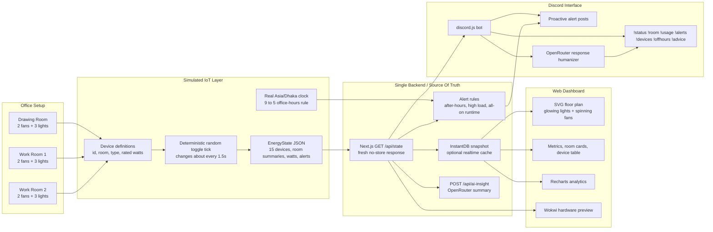
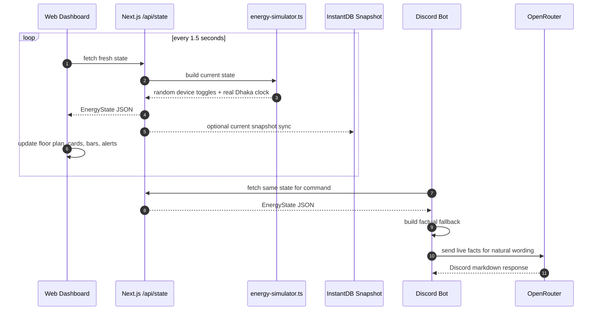
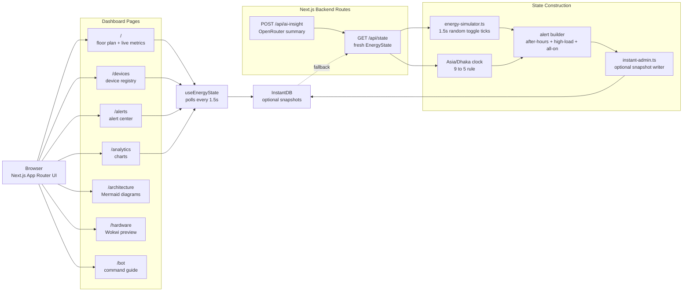
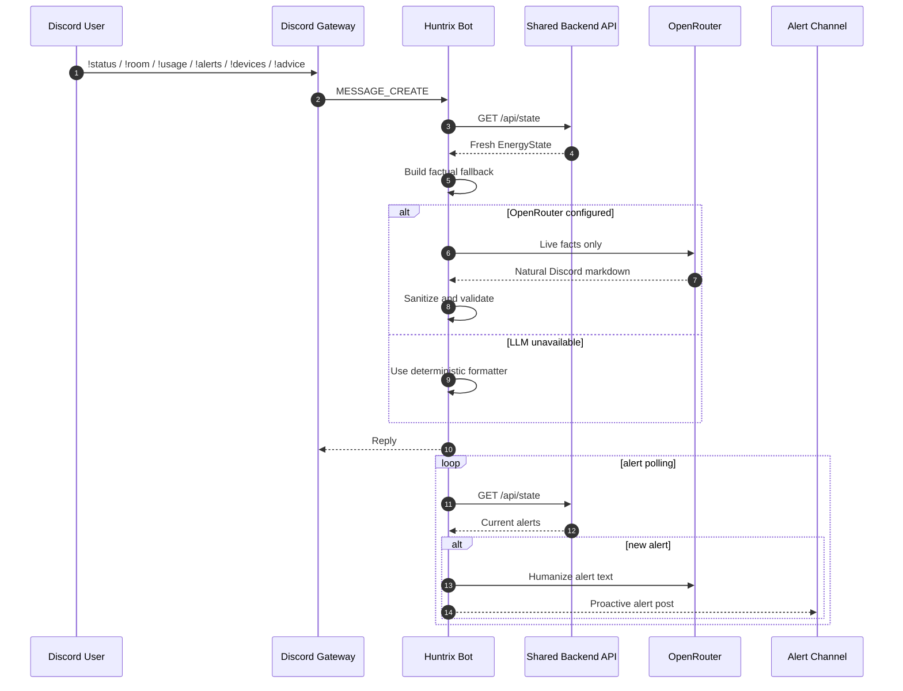
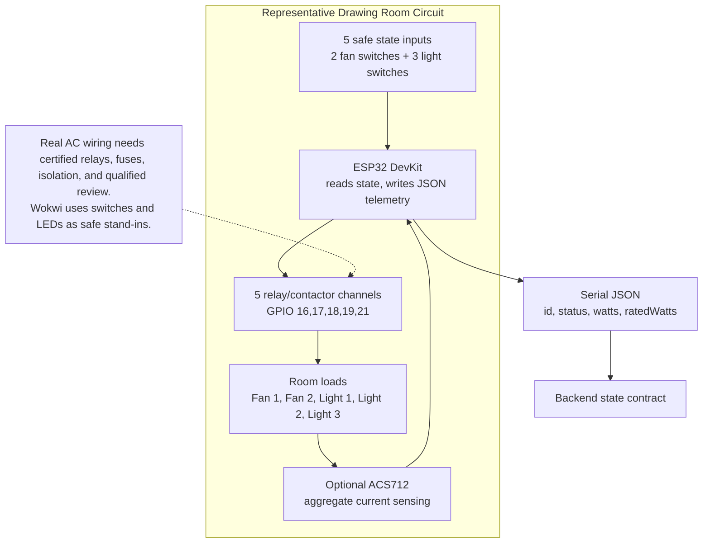
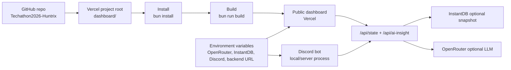

# Techathon 2026 - Office Energy Monitor

A real-time office energy monitoring system for the Techathon Nationals Hackathon preliminary round.

Team: **Huntrix**

Repository name target: `Techathon2026-Huntrix`

The project goal is to monitor office lights and fans through one shared backend, a live animated web dashboard, and a Discord bot. The system uses simulated IoT device data because no physical hardware is required for the preliminary round.

## Problem Understanding

The office runs daily coordination through Discord, but lights and fans are often left running after people leave. The required solution should let users:

- See every room's lights and fans on a live dashboard.
- Track current power usage across the office and per room.
- Receive alerts for suspicious or wasteful usage.
- Ask a Discord bot for status and usage without opening the dashboard.

The problem statement has one device-count conflict:

- It defines 3 rooms.
- Each room has 2 fans and 3 lights.
- That means 15 total devices.
- Later text mentions 18 devices.

This project follows the fixed room/device definition: 15 devices total.

## Required Features

- Shared backend as the single source of truth.
- Simulated dynamic device data.
- Real-time dashboard updates without page refresh.
- Live device status grouped by room.
- Live total and per-room power usage.
- Active alerts panel.
- Discord bot commands:
  - `!status`
  - `!room <name>`
  - `!usage`
  - `!alerts`
  - `!devices`
  - `!offhours`
  - `!advice`
- System architecture diagram.
- Representative hardware/electrical schematic for one room.
- Clear setup and run instructions.
- Short demo video.

## Target Architecture

Both the dashboard and Discord bot read from the same backend state. The bot does not generate independent random data.



## Runtime Data Flow



## Web Dashboard Architecture



## Discord Bot And AI Flow



## Hardware Concept Diagram



## Deployment Diagram



## Tech Stack

- Frontend/backend: Next.js App Router, React, TypeScript
- UI: Tailwind CSS and shadcn/ui
- Charts: Recharts through shadcn chart components
- Icons: Tabler Icons
- Animation: CSS/SVG animations
- Shared state: Next.js API route with InstantDB snapshot support
- Discord bot: discord.js
- Data source: deterministic random simulated IoT device layer with frequent visible toggles
- Hardware concept: Wokwi ESP32 relay/sensing circuit
- AI: OpenRouter `openrouter/free` for energy recommendations, with deterministic fallback

## Dashboard Experience

The dashboard includes:

- Top-view layout with Drawing Room, Work Room 1, and Work Room 2.
- Lights glow when on.
- Fans spin when running.
- Room-level power cards.
- Animated total watt meter.
- Alerts visible at a glance.
- Device list grouped by room.
- Analytics page with live trend, room comparison, and fan/light split.
- AI Energy Coach with OpenRouter-generated recommendations.
- Discord bot page with command set and live response preview.
- Architecture page with system and hardware diagrams.

Routes:

```text
/              live overview and SVG floor plan
/devices       device registry with runtime and last-changed fields
/alerts        alert rules and active alert timeline
/analytics     live charts and session peak load
/architecture  system diagram and one-room schematic
/bot           Discord command guide and live preview
```

## Backend Data Model

Each simulated device should include:

```ts
type Device = {
  id: string;
  name: string;
  type: "fan" | "light";
  room: "drawing-room" | "work-room-1" | "work-room-2";
  status: "on" | "off";
  watts: number;
  lastChanged: string;
  onSince?: string;
};
```

The simulator keeps real Asia/Dhaka time for office-hours rules, while device states use deterministic random toggles about every 1.5 seconds so dashboard changes are visible during a short demo.

## API

```text
GET /api/state
```

The dashboard polls this endpoint for demo-safe real-time updates, and the Discord bot reads the same endpoint for command responses.

```text
GET /api/ai-insight
```

Returns an AI-generated operational recommendation using OpenRouter when `OPENROUTER_API_KEY` is configured. If the API is unavailable, the endpoint returns a deterministic fallback insight so the demo remains runnable.

## Alert Rules

- Device on after office hours, assuming office hours are 9 to 5 in Asia/Dhaka time.
- All devices in one room on for more than 2 hours.
- Optional: unusually high total watt usage.

## Discord Bot Behavior

The bot should answer with concise, human-friendly messages from live backend data.

Example commands:

```text
!status
!room drawing
!room work1
!room work2
!usage
!alerts
!devices
!offhours
```

Bonus behavior: proactively post to a configured channel when a new alert appears.

## AI Integration

The project uses OpenRouter's OpenAI-compatible chat API with the free model router:

```text
OPENROUTER_MODEL=openrouter/free
```

AI is used in two places:

- Dashboard: the AI Energy Coach summarizes live office usage and recommends the next operational action.
- Discord: `!advice` asks the same live backend state for a concise energy-saving recommendation.

The prompt includes current room loads, active devices, office-hours state, kWh estimate, and active alerts. The AI never owns the source of truth; it only explains the simulated IoT state already produced by the backend. If the OpenRouter key is missing or the free endpoint is unavailable, the app uses rule-based fallback advice.

## Repository Structure

```text
.
├── bot/
│   ├── src/
│   ├── .env.example
│   └── package.json
├── dashboard/
│   ├── app/
│   ├── components/
│   ├── lib/
│   └── package.json
├── docs/
│   ├── assets/
│   ├── architecture.md
│   ├── hardware-schematic.md
│   ├── plan.md
│   ├── team-contributions.md
│   └── todo.md
├── wokwi/
│   ├── diagram.json
│   ├── sketch.ino
│   └── README.md
├── README.md
├── Rulebook.pdf
└── Problem Statement (Preliminary Round) v1.2.pdf
```

## Environment Variables

Planned variables:

```text
PORT=4000
CORS_ORIGIN=http://localhost:5173
DISCORD_TOKEN=
DISCORD_CHANNEL_ID=
BACKEND_URL=http://localhost:4000
```

## Local Development

Run the dashboard:

```bash
bun run install:all
bun run dev:dashboard
```

Dashboard services:

- Web dashboard: `http://127.0.0.1:3000`
- Shared state API: `http://127.0.0.1:3000/api/state`

Run the Discord bot:

```bash
cd bot
cp .env.example .env
bun install
bun run start
```

Bot environment:

```text
DISCORD_TOKEN=your_bot_token
BACKEND_URL=http://127.0.0.1:3000
DISCORD_CHANNEL_ID=optional_alert_channel_id
OPENROUTER_API_KEY=optional_openrouter_key
OPENROUTER_MODEL=openrouter/free
```

Bot commands:

```text
!status
!room drawing
!room work1
!room work2
!usage
!alerts
!devices
!offhours
!advice
!help
```

Run checks:

```bash
bun run check
```

## Diagrams And Hardware

- System diagram: [docs/assets/system-architecture.svg](docs/assets/system-architecture.svg)
- Hardware schematic: [docs/assets/one-room-hardware-schematic.svg](docs/assets/one-room-hardware-schematic.svg)
- Hardware explanation: [docs/hardware-schematic.md](docs/hardware-schematic.md)
- Wokwi representative circuit: [wokwi/diagram.json](wokwi/diagram.json)
- Wokwi sketch: [wokwi/sketch.ino](wokwi/sketch.ino)
- Live Mermaid diagrams: [`dashboard/app/architecture/page.tsx`](dashboard/app/architecture/page.tsx)

## Team Contributions

| Member | University | Primary Contribution |
| --- | --- | --- |
| Touhidul Alam Seyam | BGC Trust University Bangladesh | Dashboard, backend integration, Discord bot, AI integration |
| Abtahee Kabir | Chittagong University of Engineering & Technology | Planning, IoT architecture, representative hardware/Wokwi direction |
| Chandni Barua Jowthi | BGC Trust University Bangladesh | Documentation, setup validation, testing checklist |
| Noore Tamanna Orny | Chittagong University of Engineering & Technology | Floor plan design, room layout review, visual refinement |

See [docs/team-contributions.md](docs/team-contributions.md) for the detailed contribution breakdown.

## Important Rulebook Notes

- Repository must be public.
- Repository should be created after the problem statement release.
- Code must be original and attributed where needed.
- AI coding assistants are allowed.
- README must explain setup, architecture, technologies, API endpoints, and AI integration details if used.
- Final submission includes GitHub link, demo video link, and team details.

## Attribution

- Next.js, React, and TypeScript for the web/backend app.
- shadcn/ui, Tailwind CSS, and Base UI for interface primitives.
- Recharts for dashboard visualizations.
- Tabler Icons for iconography.
- Sonner for toast notifications.
- Discord.js for the Discord bot.
- InstantDB for shared realtime-ready state snapshots.
- OpenRouter `openrouter/free` for optional AI energy recommendations.
- Wokwi for the representative ESP32 hardware simulation concept.
- AI coding assistance was used during implementation and documentation, with code reviewed and tested before submission.

## Current Status

The dashboard and Discord bot are implemented as separate packages. The dashboard exposes the shared live state API, and the bot reads from that same endpoint. The repo also includes SVG diagrams and a representative Wokwi circuit for the hardware deliverable.
