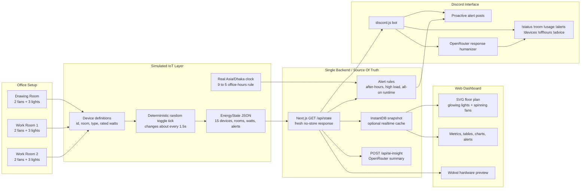
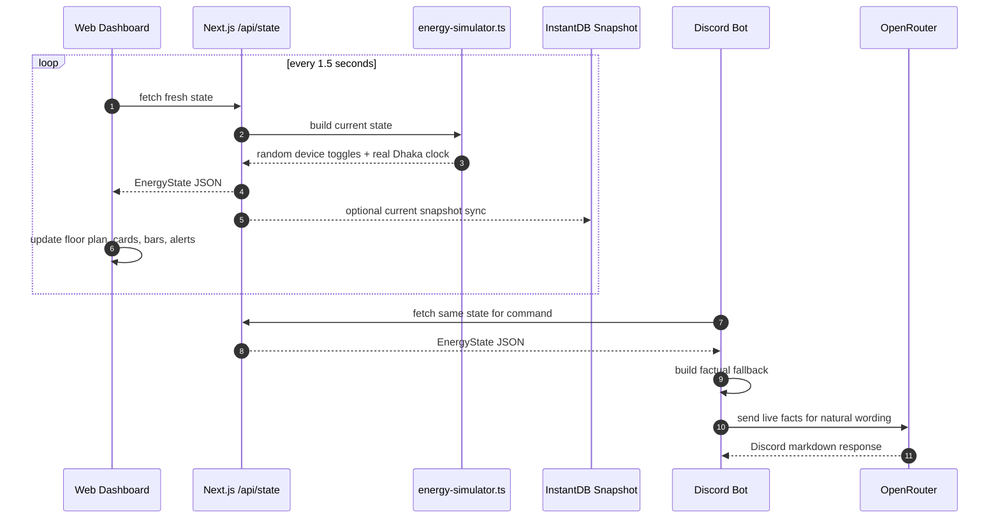

# Architecture

The system has one source of truth: the backend state exposed by the dashboard package. The simulated device layer creates live device state, and both the dashboard and Discord bot read that same backend contract.

## Whole System



## Runtime Data Flow



## Component Responsibilities

### Device Simulator

- Defines 3 rooms and 15 devices.
- Uses deterministic random state toggles about every 1.5 seconds so changes are easy to observe in the demo.
- Keeps real Asia/Dhaka time for the 9 to 5 office-hours rule.
- Tracks `lastChanged`, `onSince`, room totals, active device counts, and watts.

### Backend API

- Serves `GET /api/state` as the shared live state endpoint.
- Calculates total and per-room power usage.
- Builds after-hours, high-load, and all-on runtime alerts.
- Optionally syncs the current state into InstantDB.

### Web Dashboard

- Polls state about every 1.5 seconds.
- Animates fan spin and light glow directly from device state.
- Shows room wattage, device tables, alerts, analytics, AI coach output, and hardware preview.

### Discord Bot

- Reads the same backend state as the dashboard.
- Answers commands with live facts.
- Uses OpenRouter to make responses sound natural when configured.
- Falls back to deterministic formatters if the LLM is unavailable.
- May post proactive alerts to a configured Discord channel.

## API Contract

```text
GET /api/state
```

Returns rooms, devices, usage, alerts, generated timestamp, and the current Dhaka office clock.

```text
POST /api/ai-insight
```

Returns AI-generated or fallback energy advice derived from the current state.

